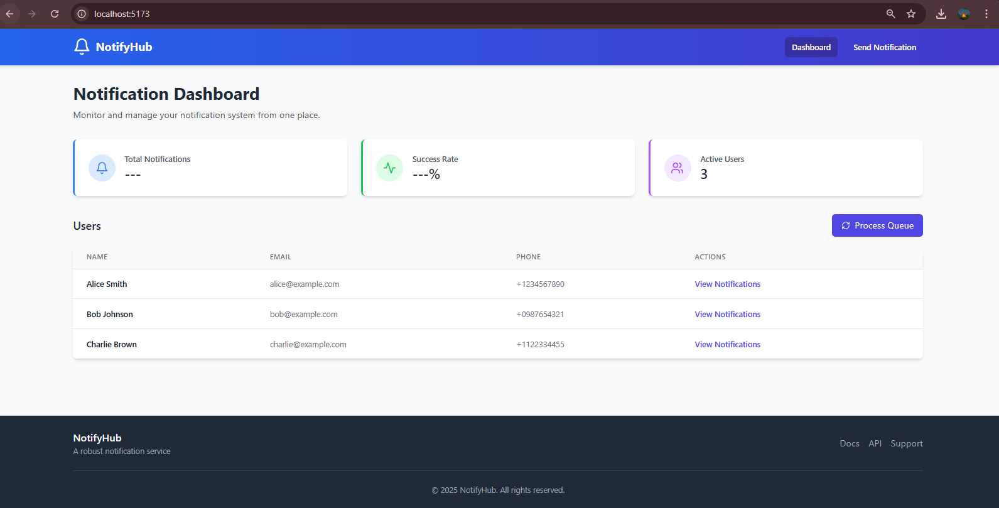
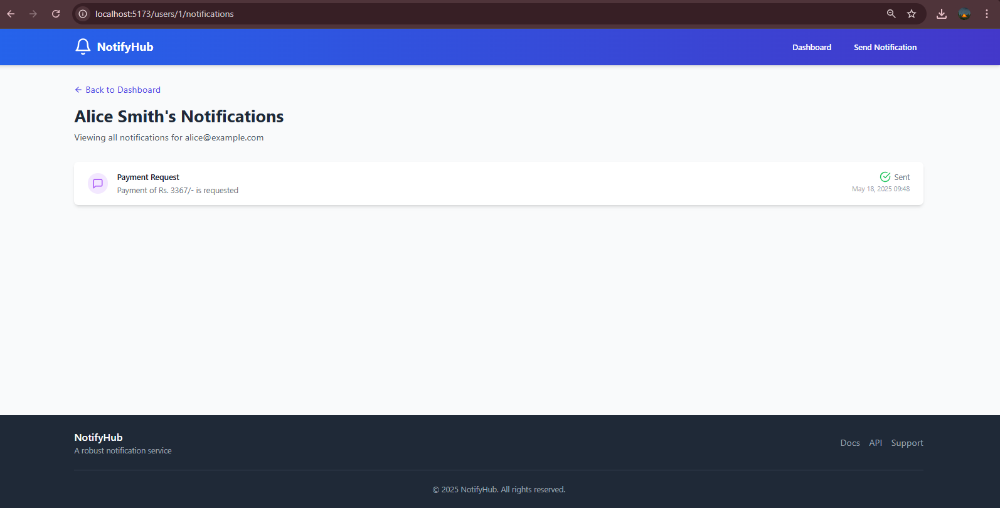

# NotifyHub - Robust Notification Service

A scalable and reliable notification service capable of sending Email, SMS, and in-app notifications to users.

## Features

- Multi-channel notification delivery (Email, SMS, in-app)
- RESTful API endpoints for sending and retrieving notifications
- Asynchronous processing with queueing system
- Persistent storage of notification history and status
- User preference management for notification channels

## Tech Stack

- **Frontend**: React, TypeScript, TailwindCSS
- **Backend**: FastAPI (Python)
- **Database**: SQLite (can be easily swapped for MongoDB or MySQL)
- **State Management**: React Query
- **Form Handling**: React Hook Form
- **Styling**: TailwindCSS

## Getting Started

### Prerequisites

- Node.js (v16+)
- Python (v3.8+)

### Installation

1. Clone the repository
2. Install dependencies:

```bash
# Install frontend dependencies
npm install

# Install backend dependencies
cd api
pip install -r requirements.txt
```

### Running the Application

1. Start the backend:

```bash
# In one terminal
cd api
uvicorn main:app --reload
```

2. Start the frontend:

```bash
# In another terminal
npm run dev
```

3. Open [http://localhost:5173](http://localhost:5173) in your browser

## API Endpoints

- `POST /notifications`: Send a notification to a user
- `GET /users/{id}/notifications`: Fetch all notifications for a specific user
- `GET /notifications/{id}`: Get a specific notification
- `GET /users`: Get all users (for demo purposes)
- `POST /process-queue`: Process the notification queue

## API Documentation (Interactive) 

- Your FastAPI backend automatically generates interactive API documentation using Swagger UI. This allows anyone (including recruiters) to easily understand, explore, and even test your API endpoints directly from their web browser without needing a separate tool.

To access the documentation:

- Ensure the backend server is running. Follow the "Running the Application" steps above to start the backend (uvicorn main:app --reload).
Once the backend is active, open your web browser and navigate to: http://127.0.0.1:8000/docs
Key features of the interactive documentation:

- Comprehensive Endpoint Listing: View all available API endpoints, their HTTP methods, and brief descriptions.
Detailed Schemas: Understand the expected request bodies and response structures for each endpoint, including data types and required fields.
"Try it out" Functionality: Directly make API calls to your running local backend, inputting parameters, and seeing real-time responses.
Error Responses: View potential error codes and their associated messages.

## Project Structure

```
├── api/                # Backend FastAPI application
│   ├── services/       # Notification services
│   ├── queue/          # Queue management
│   ├── main.py         # Main application
│   ├── models.py       # Database models
│   └── schemas.py      # Pydantic schemas
├── src/                # Frontend React application
│   ├── api/            # API client
│   ├── components/     # React components
│   ├── pages/          # Page components
│   └── types/          # TypeScript types
└── README.md           # Project documentation
```

## Implementation Details

- The system uses a queueing mechanism for asynchronous processing
- Notifications are stored in a database with their status and metadata
- Users can have preferences for which notification channels they want to receive
- The frontend provides a simple interface for sending and viewing notifications

## Assumptions & Design Choices

- **Local Development Environment:** The project is primarily configured for local development using SQLite.
- **Mock External Services:** For demonstration, actual email/SMS sending is mocked. In a production environment, integration with real third-party providers (e.g., Twilio, SendGrid) would be required.
- **Database-backed Queue:** A simple database table is used for the queue. For high-volume production, a dedicated message broker (like RabbitMQ or Kafka) would be employed, potentially with a separate worker process.
- **Frontend Simplification:** The frontend provides core functionality for demonstration, but production UI would include more robust error handling, loading states, and user feedback.

### Running the Application

... (existing instructions) ...

Once running, you should see the Notification Dashboard in your browser:





**To process queued notifications and update metrics:**
After sending notifications from the frontend, open `http://localhost:8000/docs` in your browser. Find the `POST /process-queue` endpoint, click "Try it out", and then "Execute". Refresh your frontend dashboard (`http://localhost:5173`) to see updated metrics.